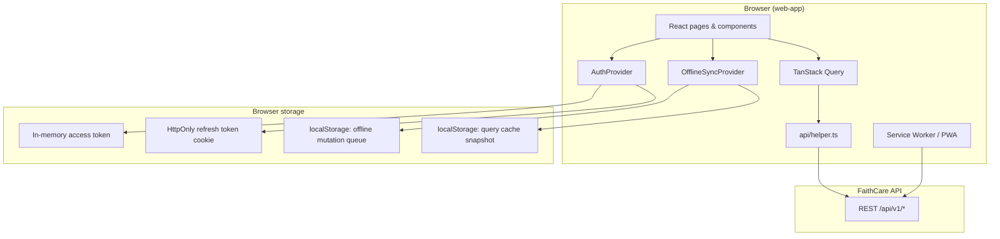
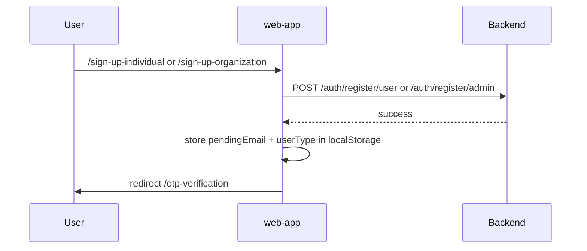
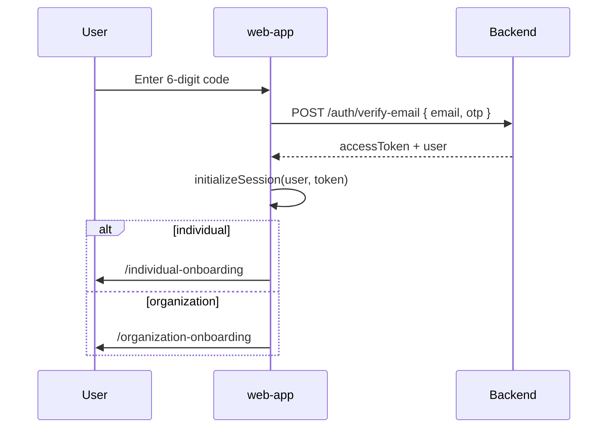
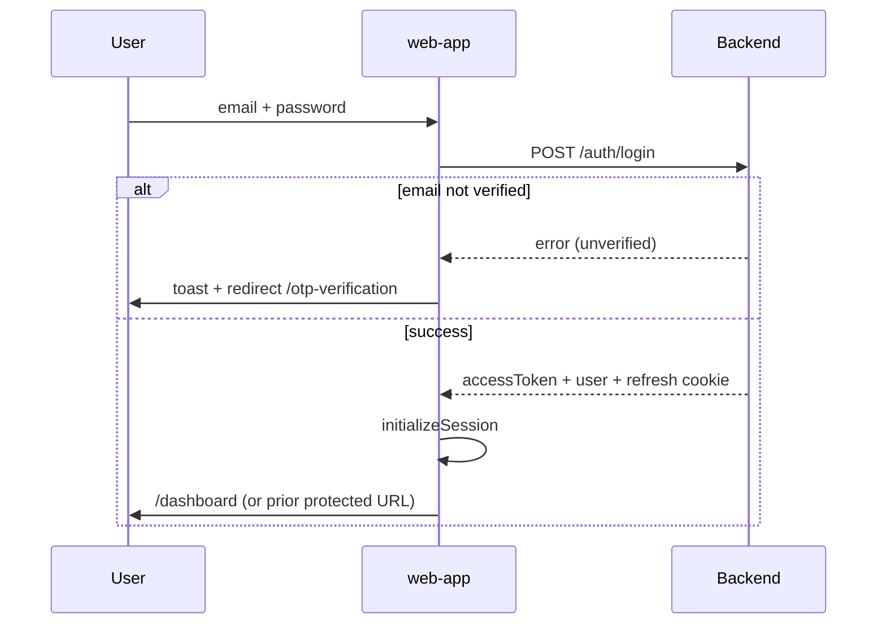
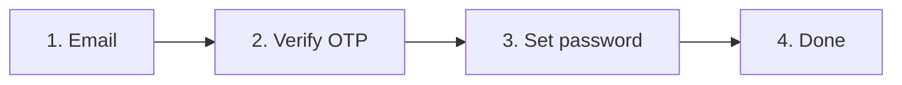
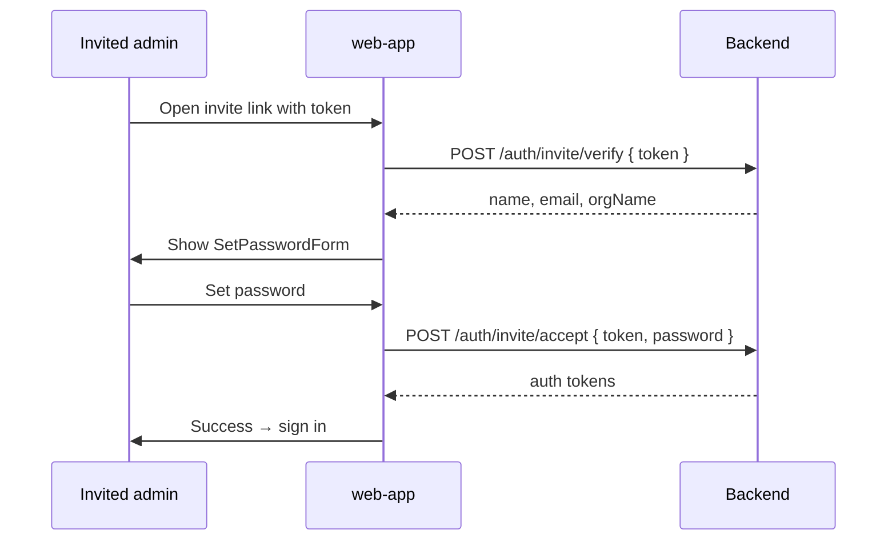
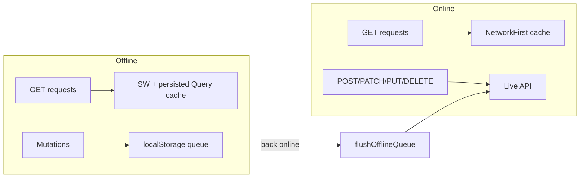
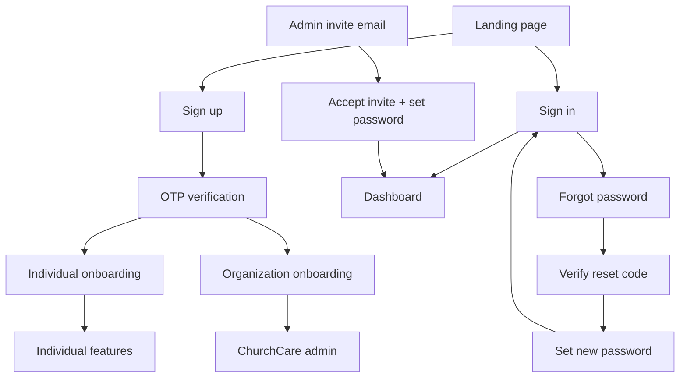

# FaithCare Frontend

FaithCare is a digital pastoral care and spiritual growth platform. This repository contains the **frontend monorepo** for FaithCare: a React dashboard (PWA) for individuals and church organizations, plus a marketing landing page.

The dashboard talks to the [FaithCare REST API](https://faithcare-13a2dc003ee9.herokuapp.com/api/v1/docs) (Swagger). Real-time notifications are handled on the backend via WebSocket at `/notifications`.

---

## Table of contents

- [Repository structure](#repository-structure)
- [Tech stack](#tech-stack)
- [Getting started](#getting-started)
- [Environment variables](#environment-variables)
- [High-level architecture](#high-level-architecture)
- [Authentication & onboarding flows](#authentication--onboarding-flows)
- [Route protection](#route-protection)
- [Individual vs organization experience](#individual-vs-organization-experience)
- [Offline support & PWA](#offline-support--pwa)
- [API layer](#api-layer)
- [Project layout (web-app)](#project-layout-web-app)
- [Scripts](#scripts)

---

## Repository structure

```
Faithcare-Frontend/
├── apps/
│   ├── web-app/          # Main React + Vite dashboard (individual + org admin)
│   └── landing-page/     # Next.js marketing site
└── README.md
```

| App | Purpose | Default dev URL |
|-----|---------|-----------------|
| **web-app** | Authenticated product UI — sign-in, onboarding, dashboards, ChurchCare tools, scripture, journal, focus timer | Vite default (`http://localhost:5173`) |
| **landing-page** | Public marketing homepage | `http://localhost:3000` |

The web-app root route (`/`) redirects to the landing page URL configured in `VITE_LANDING_PAGE_URL`, so in local development you typically run **both** apps.

---

## Tech stack

### web-app

- **React 18** + **TypeScript** + **Vite 6**
- **React Router 7** for client-side routing
- **TanStack Query** for server state, caching, and offline persistence
- **React Hook Form** + **Zod** for forms and validation
- **Tailwind CSS 4** + **Radix UI** / shadcn-style components
- **vite-plugin-pwa** — installable PWA with service worker and API GET caching

### landing-page

- **Next.js 16** + **React 19** + **Tailwind CSS 4**

---

## Getting started

### Prerequisites

- Node.js 18+ (20+ recommended)
- npm

### Install & run the dashboard

```bash
cd apps/web-app
npm install
cp .env.example .env   # if present; otherwise create .env (see below)
npm run dev
```

### Install & run the landing page

```bash
cd apps/landing-page
npm install
npm run dev
```

For the full local experience, set `VITE_LANDING_PAGE_URL=http://localhost:3000` in `apps/web-app/.env` so visiting the dashboard origin redirects to the marketing site.

---

## Environment variables

### `apps/web-app/.env`

| Variable | Description |
|----------|-------------|
| `VITE_API_URL` | Backend API base URL, e.g. `https://faithcare-13a2dc003ee9.herokuapp.com/api/v1` |
| `VITE_LANDING_PAGE_URL` | URL of the marketing site; web-app `/` redirects here |

---

## High-level architecture



**Boot sequence**

1. `main.tsx` mounts `QueryClientProvider` → `App`.
2. `AuthProvider` calls `initializeSession()` on load:
   - If a **refresh token cookie** is valid → fetches a new access token and decodes user from JWT.
   - Otherwise → user stays unauthenticated (guest routes only).
3. `OfflineSyncProvider` hydrates persisted query cache and attempts to flush any offline mutation queue when online.
4. `App.tsx` renders routes inside `AuthProvider` + `OfflineSyncProvider`; `OfflineBanner` shows connectivity/sync status.

---

## Authentication & onboarding flows

### 1. Sign up (individual or organization)



- **Individual**: `POST /auth/register/user` via `signUpUser()`.
- **Organization admin**: `POST /auth/register/admin` via `signUpOrg()`.
- On success, email is stored and the user is sent to **OTP verification**.

### 2. Email OTP verification (registration)

Route: `/otp-verification` (`OTPVerification.tsx`)



- Resend: `POST /auth/resend-otp` with `{ email, type: "email_verification" }`.
- After verification, the user is logged in immediately (tokens returned).

### 3. Sign in

Route: `/sign-in` (`SignIn.tsx`)



- **GuestRoute** blocks signed-in users from auth pages and sends them to `/dashboard`.
- Unverified accounts are redirected to OTP verification after a short delay.

### 4. Forgot password (multi-step)

Route: `/forgot-password` (`ForgotPassword.tsx`)

This flow is split into **four UI steps** so the verification code and new password are never on the same screen:



| Step | UI | API |
|------|----|-----|
| **Email** | User enters account email | `POST /auth/forgot-password` |
| **Verify** | 6-digit code only (no password fields) | Client validates format; resend via `POST /auth/resend-otp` with `type: "password_reset"` |
| **Password** | New password + confirm | `POST /auth/reset-password` `{ email, otp, newPassword }` |
| **Done** | Success message → sign in | — |

**Important:** The backend validates the OTP when `reset-password` is called. There is no separate “verify reset OTP” endpoint today. If the API returns an OTP-related error on the password step, the user is sent back to the verify step.

### 5. Admin invite (set password)

Route: `/auth/accept-invite?token=...` (`AcceptInvite.tsx`)

Mirrors a verify-then-set-password pattern with **server-side token validation**:



### 6. Session lifecycle

| Concern | Implementation |
|---------|----------------|
| **Access token** | Stored in memory only (`setInMemoryToken` in `api/helper.ts`) — not in localStorage |
| **Refresh token** | HttpOnly cookie; sent with `credentials: "include"` |
| **Session restore** | On app load, `AuthProvider` → `refreshToken()` → decode JWT for user |
| **401 handling** | `apiRequest` auto-refreshes token, retries failed request, queues subscribers during refresh |
| **Logout** | `POST /auth/logout`, clears token, user, query cache, and offline queue |

---

## Route protection

### Guest routes

Wrapped in `<GuestRoute />` — only for **unauthenticated** users:

- `/sign-in`, `/sign-up-*`, `/forgot-password`, `/otp-verification`

Authenticated users are redirected to `/dashboard`.

### Protected routes

Wrapped in `<ProtectedRoute />` — requires a valid session.

Optional `allowedRoles={['individual']}` or `['organization']` restricts by user type (derived from JWT / user object).

**Onboarding gates** (inside `ProtectedRoute`):

| User type | Condition | Redirect |
|-----------|-----------|----------|
| **Organization** | No `organizationId` | → `/organization-onboarding` |
| **Individual** | No user metadata record | → `/individual-onboarding` |

Once onboarding is complete, visiting onboarding URLs redirects to `/dashboard`.

### Public (no guest wrapper)

- `/` — redirects to landing page
- `/auth/accept-invite` — invite flow (token in query string)
- `/register` — registration entry
- `/unauthorized`, `*` (404)

---

## Individual vs organization experience

After authentication and onboarding, the **same app shell** (`AppLayout` + `Sidebar`) renders different navigation and dashboards based on `userType`.

### Individual (`userType: "individual"`)

| Area | Routes | Description |
|------|--------|-------------|
| Dashboard | `/dashboard` | Personal growth stats |
| Sunday Journal | `/sunday-journal` | Devotional / sermon journal |
| Scripture | `/scripture/*` | Today’s reading, Bible reader, plans, bookmarks, history |
| Focus Timer | `/focus-timer` | Pomodoro-style sessions with scripture rewards |
| Settings | `/settings`, `/settings/change-password` | Profile and password |

### Organization (`userType: "organization"`)

ChurchCare admin tools for pastoral teams:

| Area | Routes | Description |
|------|--------|-------------|
| Dashboard | `/dashboard` | Org metrics and trends |
| First / Second Timers | `/first-timers`, `/second-timers` | Visitor registration and follow-up pipeline |
| Salvation Records | `/salvation-records` | Decision records |
| Communities | `/communities` | Member groups |
| Prayer Requests | `/prayer-requests` | Incoming requests from members |
| Follow Ups | `/follow-ups` | Tasks with WhatsApp/SMS messaging |
| Bulk Messaging | `/bulk-messaging` | Campaign-style outreach |
| Message Templates | `/message-templates` | Custom + preset templates |
| Settings | `/settings` | Org admin settings |

`Dashboard.tsx` chooses `IndividualDashboard` vs `OrganizationDashboard` based on `user.organizationId` and role.

---

## Offline support & PWA

The web-app is an **installable PWA** with offline-aware data access.



### Service worker (`vite.config.ts`)

- Caches static assets and uses **NetworkFirst** for GET requests to the API origin.
- `navigateFallback` serves `index.html` for SPA routing.

### Query cache persistence (`offlineQueryCache.ts`)

- Successful TanStack Query results are debounced to `localStorage` (up to 80 entries, 24h TTL).
- On reload, cache is hydrated so lists and detail views can render from stale data offline.

### Mutation queue (`offlineQueue.ts` + `syncOfflineQueue.ts`)

When offline (or on network failure), non-GET API calls that are **not auth endpoints** are queued in `localStorage`:

- `OfflineSyncProvider` flushes the queue on `online`, tab visibility, and initial mount.
- Max 5 retries per queued item.
- `OfflineBanner` shows offline status or pending sync count.

**Excluded from queue** (must be online): all `/auth/*` routes including login, register, forgot/reset password, verify-email, etc.

---

## API layer

All HTTP traffic goes through `apps/web-app/src/api/helper.ts`:

- `apiRequest()` — low-level fetch with auth header, 401 refresh, offline queue
- `apiGet`, `apiPost`, `apiPatch`, `apiPut`, `apiDelete` — typed helpers returning `ApiResponse<T>`

Domain modules:

| Module | Path | Responsibility |
|--------|------|----------------|
| `auth/auth.ts` | `/auth/*` | Login, register, OTP, password reset, invite, refresh, logout |
| `individual/individual.ts` | `/users/metadata/*` | Individual profile metadata and onboarding |
| `organization/church.ts` | `/organizations/*`, `/church/*` | Org creation, first timers, follow-ups, communities, etc. |
| `scripture/scripture.ts` | `/scripture/*`, `/bible/*` | Bible reader, plans, bookmarks |
| `admin/admin.ts` | `/admin-applications/*` | Admin join applications |
| `memorization/memorization.ts` | `/memorization/*` | Verse memorization (UI routes currently commented out) |

Shared types live in `api/shared/types.ts` (`ApiResponse`, pagination, etc.).

---

## Project layout (web-app)

```
apps/web-app/src/
├── api/                 # Backend client modules
├── app/
│   ├── App.tsx          # Route definitions
│   ├── components/      # Feature + UI components
│   ├── contexts/        # LayoutContext, etc.
│   ├── layouts/         # AppLayout (sidebar shell)
│   ├── pages/           # Route-level pages
│   └── providers/       # AuthProvider, OfflineSyncProvider
├── constants/           # API base URL, select options
├── hooks/               # useOnlineStatus, etc.
├── lib/                 # queryClient, offline queue, sync, utils
├── main.tsx             # Entry point
└── styles/              # Global CSS / Tailwind
```

---

## Scripts

### web-app

| Command | Description |
|---------|-------------|
| `npm run dev` | Start Vite dev server with HMR |
| `npm run build` | Typecheck + production build |
| `npm run preview` | Preview production build |
| `npm run lint` | ESLint |

### landing-page

| Command | Description |
|---------|-------------|
| `npm run dev` | Start Next.js dev server |
| `npm run build` | Production build |
| `npm run start` | Run production server |
| `npm run lint` | ESLint |

---

## End-to-end user journeys (summary)



---

## API documentation

Full backend reference (endpoints, DTOs, auth schemes):

**https://faithcare-13a2dc003ee9.herokuapp.com/api/v1/docs**

---

## License

Private repository — see project owners for licensing and deployment details.
